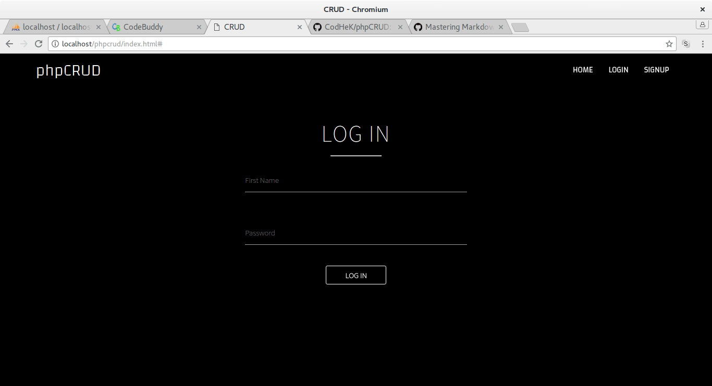
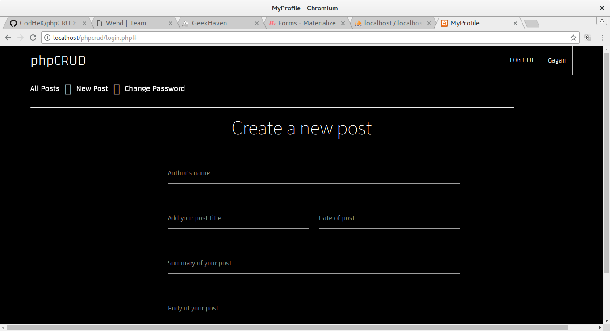

# phpCRUD
A Crud Application using php/MySQL

## To use:

### 1. Clone, Download the Zip
### 2. I assume you have mySQL, php installed
### 3. Open phpmyadmin
### 4. Create a DataBase named ->  login
### 5. Create a Table named -> userDetails
### 6. Make 3 columns -> name, email, password
### 7. Go to localhost/(foldername)/index.html and use it ! :D

## How the App looks:

